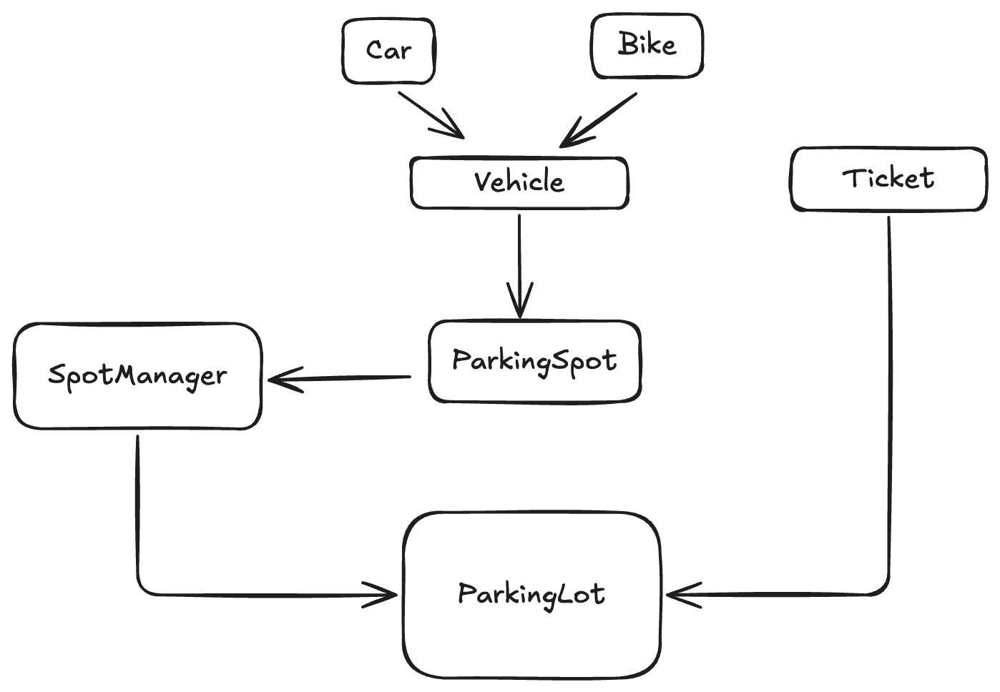

# Parking lot LLD

## Design a parking lot system that supports different types of parking spots (e.g., for bikes, cars, trucks), ticket generation, entry/exit, and billing.

## Requirement
* There are multiple entry and exit gates.
* There are different parking spot types (bike, car, truck).
* When a vehicle enters:
    - It gets a ticket.
    - Allocate the nearest available spot of the correct type.

* When a vehicle exits:
    - Compute fee on exit using simple hourly pricing.
    - The spot is freed.

## HLD

                         +------------------+
                         |   VehicleType    |
                         | {BIKE,CAR,TRUCK} |
                         +------------------+

+-------------------+                 +----------------------------+
|      Vehicle      |                 |         Ticket             |
+-------------------+                 +----------------------------+
| - vehicleNumber   |                 | - ticketId: string         |
| - vehicleType: VT |                 | - entryTime: Date          |
+-------------------+                 | - vehicleNumber: string    |
                                      | - spotId: string           |
                                      | - entryGateId: string      |
                                      +----------------------------+

                         is-a
     +---------------------^---------------------+
     |                                           |
+------------+      +------------+        +-------------+
|  CarSpot   |      |  BikeSpot  |        |  TruckSpot  |
+------------+      +------------+        +-------------+
      is-a                 is-a                  is-a
          \                 |                    /
           \                |                   /
            \               |                  /
             v              v                 v
                +----------------------------+
                |        ParkingSpot         |
                +----------------------------+
                | - spotId: string           |
                | - vehicleType: VT          |
                | - isFree: boolean          |
                | - assignedVehicle?:Vehicle |
                | - distanceByGate: {gateId->d}
                +----------------------------+
                | + distanceFromGate(gateId) |
                | + assignVehicle(v)         |
                | + removeVehicle()          |
                +----------------------------+

+----------------------------+          has-a (manages many)
|        SpotManager         |------------------------------------+
+----------------------------+                                    |
| - spots: ParkingSpot[]     |                                    |
+----------------------------+                                    |
| + addSpot(spot)            |                                    |
| + getSpot(id)              |                                    |
| + releaseSpot(id)          |                                    |
| + nearestFree(type, gate)  |<--- uses ParkingSpot.distanceFromGate
+----------------------------+

                 has-a (uses)
+----------------------------+
|        ParkingLot          |
+----------------------------+
| - ticketsById: Map         |
| - spots: SpotManager       |
| - now(): Date              |
| - makeId(): string         |
+----------------------------+
| + issueTicket(vehicle,     |
|               entryGateId) |
| + exit(ticketId, exitGate) |
+----------------------------+

## Sequence: issueTicket(vehicle, entryGateId)
Client         ParkingLot         SpotManager           ParkingSpot         Ticket
  |                |                   |                    |                 |
  |--issueTicket(v, gateId)            |                    |                 |
  |                |--nearestFree(type, gateId)----------->|                 |
  |                |                   |---- returns Spot --|                 |
  |                |--assignVehicle(v)-------------------->|--assignVehicle--|
  |                |                   |                    |                 |
  |                |-- new Ticket ------------------------>|                 |
  |                |<-------------- ticket ----------------|                 |
  |<----------- ticket ------------------------------------|                 |

## Sequence: exit(ticketId, exitGateId)
Client         ParkingLot         SpotManager          ParkingSpot
  |                |                   |                   |
  |--exit(ticketId, gateId)           |                   |
  |                |-- getSpot(spotId) ------------------->|
  |                |                   |---- spot ---------|
  |                |-- computeFee(entry, now, type)        |
  |                |-- releaseSpot(spotId) ----------------|
  |<------ {ticket, exitTime, fee} ------------------------|
